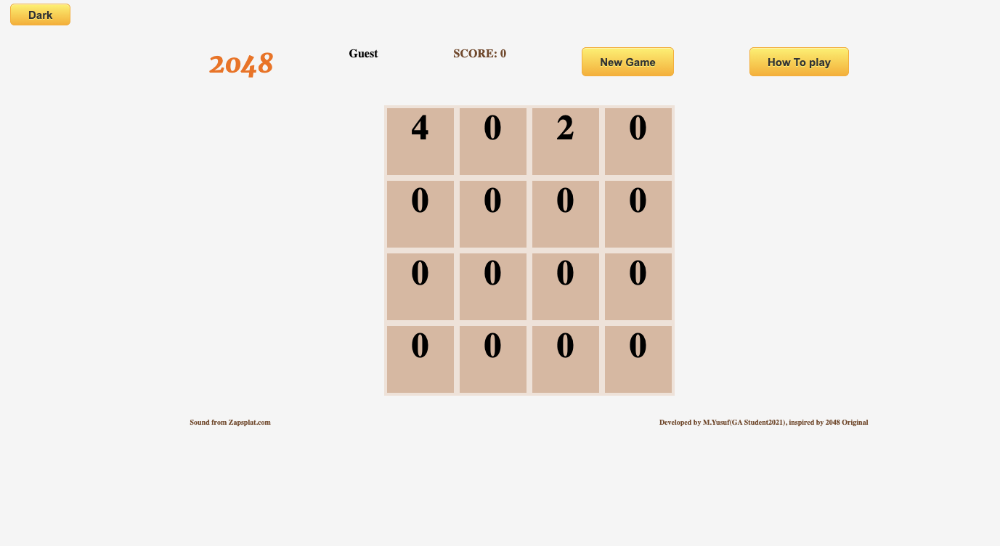
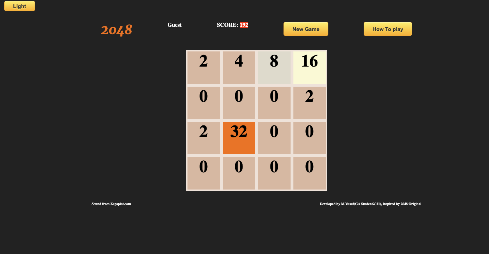

###  General Assembly, Software Engineering Immersive
# 2048


## Overview
This is my first project of the software engineering immersive course at GA London. The assignment was to create a grid-based game to be rendered in the browser, using HTML, CSS and JavaScript. The project was to be completed **individually** within **one week**.

Given a list of options from GA, I chose to re-create the classic game **2048**. Please note that while the game is designed in terms of roombas and cats, this documentation is written in terms of the original Pac-Man lingo, e.g. referring to _ghosts_ and _energizers_, as the underlying code also uses this jargon. 

## Brief

- **Render a game in the browser**
- **Design logic for winning & visually display which player won**
- **Include separate HTML / CSS / JavaScript files**
- Use **Javascript** for **DOM manipulation**
- **Deploy your game online**, where the rest of the world can access it
- Use **semantic markup** for HTML and CSS (adhere to best practices)

## Technologies used

- HTML
- CSS
- JavaScript
- Git and GitHub
- Google Fonts


## Approach

### Board layout
- I decided to break to solve the problem into three major parts, and every part into multible sub part
- for the openeing gam board I decided to render the grid first then through two number(2-4)so I build a for loop to render the 16 tile and append it into the parent div 
```
for (let i = 0; i < width * width; i++) {
  tile = document.createElement('div')
  tile.innerHTML = 0
  tile.classList.add('tile-styled')
  grid.append(tile)
  gridTiles.push(tile)
  }
  ```
then I built a function to add the two numbers in a random tile inside the grid as following:
```
function adding2ToTheOpeningBoard(arr) {
  randomTile = gridTiles[Math.floor(Math.random() * gridTiles.length)]
  if (randomTile.innerHTML === '0') {
    randomTile.innerHTML = Math.random() < 0.5 ? arr[0] : arr[1]
    startGame.play()
  } else {
    adding2ToTheOpeningBoard([2, 4])
  }
}
```
### Monapilating the DOM wile game on going
then I wrapped all my code inside an eventListener (start playing)
then I start to build arraies to reflect the layout of the grid and what value each tile has conatain and convert it into Number an ddo the following logic
```
for (let i = 0; i < gridTiles.length; i++) {
      if (i % 4 === 0) {
        const firstCol = gridTiles[i].innerHTML
        const secondCol = gridTiles[i + 1].innerHTML
        const thirdCol = gridTiles[i + 2].innerHTML
        const fourthCol = gridTiles[i + 3].innerHTML
        const rows = [Number(firstCol), Number(secondCol), Number(thirdCol), Number(fourthCol)]
        const sortedRow = rows.filter(number => number > 0)
        const emptyTile = 4 - sortedRow.length
        const filling = Array(emptyTile).fill(0)
        const newRow = filling.concat(sortedRow)
        gridTiles[i].innerHTML = newRow[0]
        gridTiles[i + 1].innerHTML = newRow[1]
        gridTiles[i + 2].innerHTML = newRow[2]
        gridTiles[i + 3].innerHTML = newRow[3]
      }
    }
  }
  ```
  and almost similarly it gooes with sliding left, only to change which array must concat another
  however as my grid has to have the functionality of sliding up and down to I had to tackle this problem by building this logic
  ```
  function building4ArraysToDown() {
    for (let i = 0; i < 4; i++) {
      const firstCol = gridTiles[i].innerHTML
      const secondCol = gridTiles[i + width].innerHTML
      const thirdCol = gridTiles[i + width * 2].innerHTML
      const fourthCol = gridTiles[i + width * 3].innerHTML
      //giting neew array of number with 4 column
      const col = [Number(firstCol), Number(secondCol), Number(thirdCol), Number(fourthCol)]

      const sortedCol = col.filter(number => number > 0)
      const emptyTile = 4 - sortedCol.length
      const filling = Array(emptyTile).fill(0)
      const newCol = filling.concat(sortedCol)
      gridTiles[i].innerHTML = newCol[0]
      gridTiles[i + width].innerHTML = newCol[1]
      gridTiles[i + width * 2].innerHTML = newCol[2]
      gridTiles[i + width * 3].innerHTML = newCol[3]
    }
  }
  ```
  ### Caculating the tile if match the game criteria
 once all the problems of moving or sliding the tiles solved, I looked back to my white board and see my initial naive appreach and append it accordingly 
 I started to write a logic to caculate the sum if there are two tile bordering each other having the same inner value, to sum them togather
 ```
 function sumRowTiles() {
    for (let i = 0; i < 15; i++) {
      if (gridTiles[i].innerHTML === gridTiles[i + 1].innerHTML) {
        const total = Number(gridTiles[i].innerHTML) + Number(gridTiles[i + 1].innerHTML)
        gridTiles[i].innerHTML = total
        gridTiles[i + 1].innerHTML = 0
        points += total
        score.innerHTML = points
        storedScore = points
      }
    }
  }
  
 // sum Column Tiles
   function sumColTiles() {
    for (let i = 0; i < 12; i++) {
      if (gridTiles[i].innerHTML === gridTiles[i + width].innerHTML) {
        const total = Number(gridTiles[i].innerHTML) + Number(gridTiles[i + width].innerHTML)
        gridTiles[i].innerHTML = total
        gridTiles[i + width].innerHTML = 0
        points += total
        score.innerHTML = points
        storedScore = points
      }
    }
  }
  ```
  
  then locgic for user control 
````
function slidngUp() {
    building4ArraysToUp()
    sumColTiles()
    adding2()
    changeTileColor()
    audio.play()
    win()
    lose()
    takingPic()
  }
  ````
  also I have added some sound effect and color effect on the event listener and some notification and using localStorage to save data of the user then renderd intop the dom such as :
 `````
 f (localStorage.dataPoints === undefined) {
    alert('this if your first time playing this game, your score is 0')
  }
  alert('your last Score was ' + localStorage.dataPoints + ', try to beat it this time')
})


// appearing and disappearing how to play text
const instructingText = document.getElementById('learn-text')
const howToPlayBtn = document.getElementById('how-to-play')
howToPlayBtn.addEventListener('click', () => {
  instructingText.style.display = 'block'
  setInterval(() => {
    instructingText.style.display = 'none'
  }, 5000)
})
 `````
 
 ### winning or game over
 player wins the ga,me when eny tile has a value of 2048, or loss if all tiles has a value greater than 0 but none of tile has a value of 2048
 
 ````
 function win() {
    for (let i = 0; i < gridTiles.length; i++) {
      if (gridTiles[i].innerHTML === '2048') {
        alert('YOU WON')
        window.location.reload()
        startGame.play()
      }
    }
  }
  win()

  function lose() {
    let count = 0
    for (let j = 0; j < gridTiles.length; j++) {
      if (gridTiles[j].innerHTML === '0') {
        count++
      }
    }
    if (count === 0) {
      alert('YOU LOST')
      window.location.reload()
      startGame.play()
    }
  }
  lose()
  ````
  
  ## Screenshots
  
  
  
  ## Bugs
  I just want to remove the Zeros from the grid tile
  
  ## Potential future features
  making a progress bar, form the current largest number in grid to 2048
  playing audio joke every 2 minutes while playing
  create smooth transition while tilse move
  
  ## Lessons learned
  setIntrval 
  recursuive function
  localstorage
  
  ## credit
Sound from Zapsplat.com
inspired by 2048 Original


  
  
